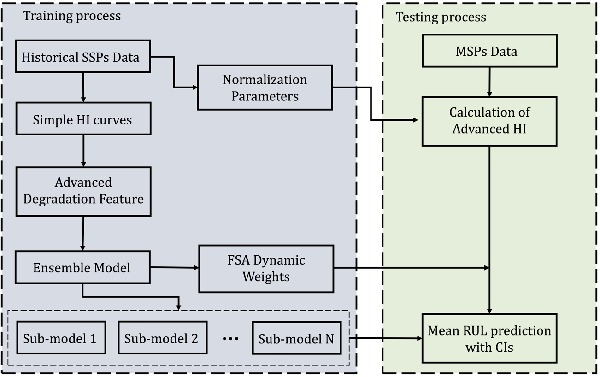

# RUL Prediction for Aeronautical Composite Structures

## Introduction

This project is part of the [ReMAP](https://h2020-remap.eu/) initiative, with its primary objective focused on enhancing the Remaining Useful Life (RUL) prediction of complex aeronautical elements. Specifically, it aims to upscale the prediction capabilities for multi-stiffener composite panels (MSPs) by leveraging historical data from single-stiffener panel histories (SSPs).

## Overview

- **Run-to-Failure Data**: Strain measurements from MSPs subjected to compression-compression fatigue are used to construct damage sensitive features, i.e., health indicators (HIs).
- **Feature-Level Fusion**: Genetic Algorithms are employed to fuse HIs, enhancing monotonicity and prognosability attributes.
- **Ensemble Approach**: An ensemble approach aggregates RUL predictions by training diverse sub-models and combining predictions with a dynamic weighting strategy based on Fuzzy Similarity Analysis (FSA).
- **Regression Techniques**: Support Vector Regression (SVR) and Long Short-Term Memory Network (LSTMN) are considered as regression techniques to map input data to RUL output.

## Flowchart of Proposed Framework
<p align='center'></p>

## Data
The strain data for each test specimen is stored in the following directory structure, where `BI` and `AI` represent measurements taken before and after impact respectively:
```commandline
experimental_campaign/
|── L2-03/
|   |── AI/
|   |   |── AI_5k/
|   |   |   |── L203_AI5K_Processed.txt
|   |   |── AI_10k/
|   |   |── AI_200k/
|   |   |── AI_610k/
|   |   |...
|
|   |── BI/
|   |   |── BI_5k/
|   |   |...
|
|── L2-04/
|── L2-05/
|── L2-07/
```
Please note that this data is not shared due to its confidential nature.
For more info about the data provided see [here](data/README.md).

## Code Structure
This repository includes a collection of helper functions under the [`utils`](utils) folder and the notebooks:
* [`svr_ensemble.ipynb`](svr_ensemble.ipynb): This notebook handles the loading of data, splitting it into training and testing sets, computing time-varying weights, training the models with their hyperparameters tuned and predicting on the testing specimens.
* [`lstm_ensemble.ipynb`](lstm_ensemble.ipynb): Similar to the previous notebook, but this one implements a custom Bayesian Optimizer to incorporate time-series cross-validation.
* [`main.ipynb`](main.ipynb): This notebook conducts the preliminary preprocessing of the raw strain measurements for a test specimen, extracting the health indicators, while calculating their prognostic performance metrics (monotonicity, prognosability). It then aggregates the RUL prediction results from the two ensembles proposed and evaluates them using metrics like RMSE, MAPE, CRA, etc..

## Setting Up
```
git clone https://github.com/efthimisfytsilis/AeroPHM-RUL-Estimation.git
```
```
cd your-local-path/AeroPHM-RUL-Estimation
```
- List of dependencies to run the project: [`requirements.txt`](requirements.txt).
